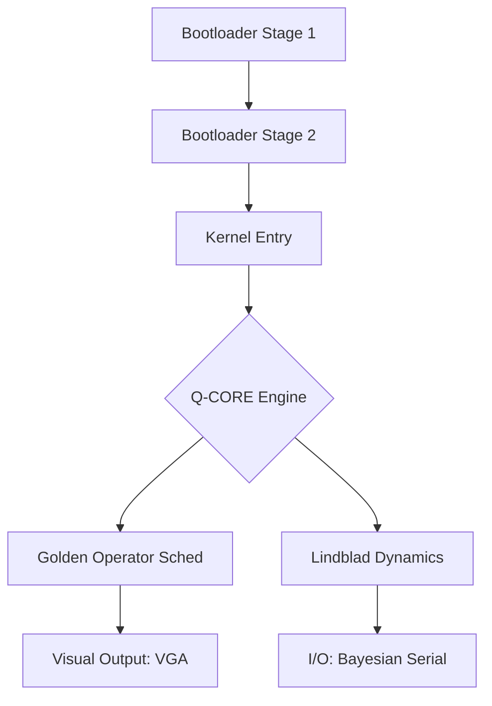

# Smopsys: Q-CORE [LAMINAR FLOW PHASE]
**Smart Operative System Baremetal Hardcore**
*Sistema Operativo con Inferencia Bayesiana Metripléctica*

Smopsys es un sistema operativo experimental que implementa una arquitectura **Metripléctica**, donde la dinámica del sistema se rige por la competencia entre una dinámica conservativa (Hamiltoniana) y una disipativa (Métrica/Entrópica).

## 🚀 Estado Actual: Laminar Flow
El proyecto ha alcanzado una fase de estabilidad operacional donde el flujo de información es predecible y la disipación es mínima ($Re_{\psi} < 2300$).

### Componentes Implementados

#### 1. Bootloader Multietapa
- **Stage 1**: Inicialización de bajo nivel y carga del Stage 2.
- **Stage 2**: Configuración del modo protegido, GDT, y habilitación de constantes físicas ($\phi, \delta$).
- **Kernel Loader**: Salto al kernel C en modo de 32 bits.

#### 2. Kernel Metripléctico (Q-CORE)
- **[Golden Operator](file:///home/jako/smopsys/Smopsys/kernel/golden_operator.h)**: Implementación del Operador Cuasiperiódico $\hat{O}_n = \cos(\pi n) \cos(\pi \phi n)$. Gestiona el scheduling basado en proyecciones dimensionales.
- **[Lindblad Master Equation](file:///home/jako/smopsys/Smopsys/kernel/lindblad.h)**: Motor de evolución cuántica abierta. Implementa el Mandato Metripléctico separando explícitamente $L_{symp}$ (Hamiltoniano) y $L_{metr}$ (Disipativo).
- **Fixed-Point Math**: Biblioteca matemática optimizada para bare-metal sin FPU.

#### 3. Drivers de Hardware
- **[VGA Holographic](file:///home/jako/smopsys/Smopsys/drivers/vga_holographic.h)**: Driver visual con mapeo de estados físicos a colores (Polo Norte/Coherente → Verde, Polo Sur/Disipativo → Rojo).
- **[Bayesian Serial](file:///home/jako/smopsys/Smopsys/drivers/bayesian_serial.h)**: Comunicación UART con inferencia bayesiana para gestión de latencia y errores.

#### 4. [SmopsysQL](file:///home/jako/smopsys/Smopsys/ql/smopsys_ql.py) (Quantum Laser Language)
Lenguaje de nivel medio para el control de pulsos cuánticos y sincronización de fase metriplética.
- **Sintaxis**: `PULSE`, `WAIT`, `MEASURE`, `ENTANGLE`, `BROADCAST`, `THERMAL`, `SYNC`.
- **Compilación**: El motor QL traduce los scripts `.sql` a código C que se enlaza directamente con el kernel.

## 🛠 Arquitectura


## 📐 El Mandato Metripléctico
Todo sistema dinámico en Smopsys debe definirse mediante:
- **$L_{symp}$**: Movimiento reversible (Conservación).
- **$L_{metr}$**: Relajación hacia el atractor (Disipación).

## 🔨 Construcción y Pruebas
El proyecto utiliza un sistema de build basado en `Makefile`.
```bash
make          # Compila el kernel y genera la imagen ISO
make run      # Ejecuta el sistema en QEMU
make test     # Ejecuta la suite de pruebas unitarias (Pytest)
```
