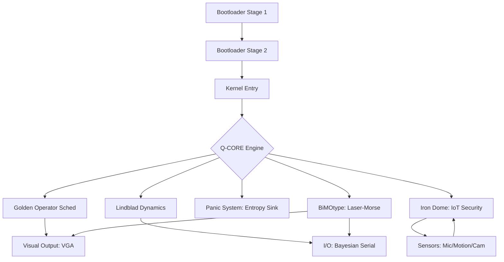

# Smopsys: Q-CORE [LAMINAR FLOW PHASE]
**Smart Operative System Baremetal Hardcore**
*Sistema Operativo con Inferencia Bayesiana Metripléctica*

Smopsys es un sistema operativo experimental que implementa una arquitectura **Metripléctica**, donde la dinámica del sistema se rige por la competencia entre una dinámica conservativa (Hamiltoniana) y una disipativa (Métrica/Entrópica).

## 🚀 Estado Actual: Laminar Flow
El proyecto ha alcanzado una fase de estabilidad operacional donde el flujo de información es predecible y la disipación es mínima ($Re_{\psi} < 2300$).

### Componentes Implementados

#### 1. Bootloader Multietapa
- **Stage 1**: Inicialización de bajo nivel y carga del Stage 2.
- **Stage 2**: Configuración del modo protegido, GDT, y habilitación de constantes físicas ($\phi, \delta$).
- **Kernel Loader**: Salto al kernel C en modo de 32 bits.

#### 2. Kernel Metripléctico (Q-CORE)
- **[Golden Operator](file:///home/jako/smopsys/Smopsys/kernel/golden_operator.h)**: Implementación del Operador Cuasiperiódico $\hat{O}_n = \cos(\pi n) \cos(\pi \phi n)$. Gestiona el scheduling basado en proyecciones dimensionales.
- **[Lindblad Master Equation](file:///home/jako/smopsys/Smopsys/kernel/lindblad.h)**: Motor de evolución cuántica abierta. Implementa el Mandato Metripléctico separando explícitamente $L_{symp}$ (Hamiltoniano) y $L_{metr}$ (Disipativo).
- **Fixed-Point Math**: Biblioteca matemática optimizada para bare-metal sin FPU.
- **[Panic System](file:///home/jako/smopsys/Smopsys/kernel/panic.h)**: Sistema de gestión de excepciones críticas que implementa la "Singularidad de Entropía Máxima". Transiciona el sistema a un estado disipativo puro para evitar la muerte térmica y proteger la integridad del kernel.


#### 3. Drivers de Hardware
- **[VGA Holographic](file:///home/jako/smopsys/Smopsys/drivers/vga_holographic.h)**: Driver visual con mapeo de estados físicos a colores (Polo Norte/Coherente → Verde, Polo Sur/Disipativo → Rojo).
- **[Bayesian Serial](file:///home/jako/smopsys/Smopsys/drivers/bayesian_serial.h)**: Comunicación UART con inferencia bayesiana para gestión de latencia y errores.

#### 4. [SmopsysQL](file:///home/jako/smopsys/Smopsys/ql/smopsys_ql.py) (Quantum Laser Language)
Lenguaje de nivel medio para el control de pulsos cuánticos y sincronización de fase metriplética.
- **Sintaxis**: `PULSE`, `WAIT`, `MEASURE`, `ENTANGLE`, `BROADCAST`, `THERMAL`, `SYNC`.
- **Compilación**: El motor QL traduce los scripts `.sql` a código C que se enlaza directamente con el kernel.

#### 6. [BiMOtype Protocol](file:///home/jako/smopsys/Smopsys/ql/bimotype.py)
Protocolo de comunicación cuántica-radiactiva mediante pulsos Laser-Morse.
- **Codificación**: Traduce texto a estados cuánticos y secuencias de pulsos.
- **Hawking Radiation**: Las firmas radiactivas son opcionales y se vinculan a la entropía de las páginas de memoria, emulando la evaporación de agujeros negros.
- **Kernel Pulse**: Implementación en `bimotype.cpp` para el parpadeo visual y serial de mensajes.


#### 5. [Memory Manager](file:///home/jako/smopsys/Smopsys/MemoryManager.cpp)
Gestor de memoria con acoplamiento termodinámico.
- **Centroide Z-Finch**: Monitorea el confinamiento de la información en las páginas.
- **Evaporación de Hawking**: Las páginas liberadas entran en un estado de evaporación granular antes de ser marcadas como vacías.

#### 6. [Iron Dome: IoT Security](file:///home/jako/smopsys/Smopsys/iron_dome/main.py)
Sistema de seguridad preventiva para el hogar basado en dinámica metripléptica.
- **Multi-Layer Pipeline**: Detección Acústica (Firma) $\rightarrow$ Confirmación de Movimiento $\rightarrow$ Seguimiento por Visión.
- **Target Identification**: Clasifica objetivos en ramas (Amenazas: Drones/Intrusos; Ambiente: Aves/Gatos/Perros).
- **Reynolds Informacional ($Re_{\psi}$)**: Utiliza la turbulencia de datos para identificar anomalías cinéticas organizadas.
- **Calibración Dinámica**: Registro automático de ruido blanco para ajuste de umbrales adaptativos.
- **StatTracker**: Auditoría de Verdaderos/Falsos Positivos para validación de confiabilidad.


## 🛠 Arquitectura

```mermaid
graph TD
    A[Bootloader Stage 1] --> B[Bootloader Stage 2]
    B --> C[Kernel Entry]
    C --> D{Q-CORE Engine}
    D --> E[Golden Operator Sched]
    D --> F[Lindblad Dynamics]
    D --> I[Panic System: Entropy Sink]
    D --> J[BiMOtype: Laser-Morse]
    D --> K[Iron Dome: IoT Security]
    E --> G[Visual Output: VGA]
    F --> H[I/O: Bayesian Serial]
    J --> G
    J --> H
    K --> L[Sensors: Mic/Motion/Cam]
    L --> K

```

## ⌨️ Shell y Diagnósticos
El sistema cuenta con un shell interactivo (`ql-bias>`) para monitorear el corazón del kernel:
- `status`: Muestra el estado del Operador Áureo y el flujo (LAMINAR/TURBULENT).
- `memory`: Resumen termodinámico (Entropía total, Centroide Z-Finch).
- `pages`: Inspección granular de los Informones (páginas de memoria).
- `ticks`: Contador de latidos de hardware (PIT).
- `laser`: Estado de la retroalimentación del sistema de pulsos.
- `panic`: (Prueba) Dispara manualmente una singularidad de entropía.
- `competition`: Muestra la lucha termodinámica ($L_{symp}$ vs $L_{metr}$) de una página.
- `bimotype <msg>`: Emite un mensaje pulsado usando el protocolo Laser-Morse.


## 📐 El Mandato Metripléctico
Todo sistema dinámico en Smopsys debe definirse mediante:
- **$L_{symp}$**: Movimiento reversible (Conservación).
- **$L_{metr}$**: Relajación hacia el atractor (Disipación).

## 🔨 Construcción y Pruebas
El proyecto utiliza un sistema de build basado en `Makefile`.
```bash
make          # Compila el kernel y genera la imagen ISO
make run      # Ejecuta el sistema en QEMU
make test     # Ejecuta la suite de pruebas unitarias (Pytest)
```
